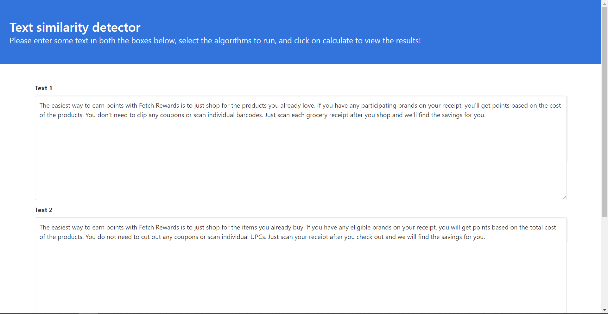
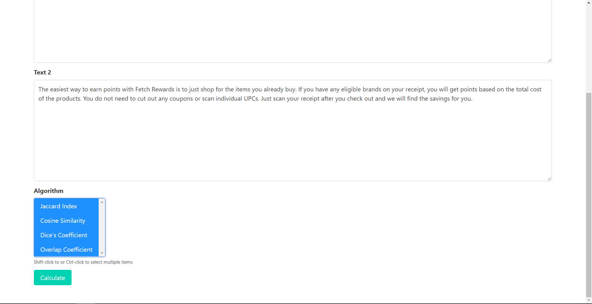
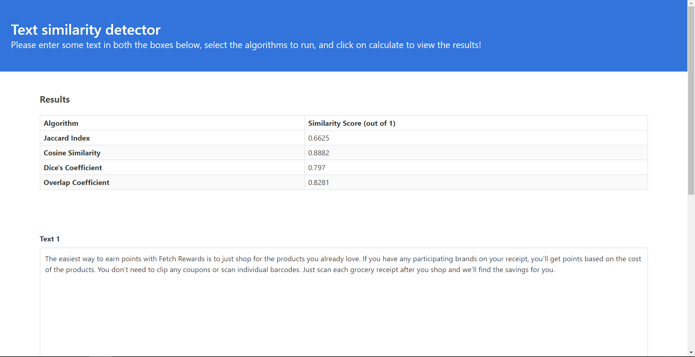

# Fetch Rewards: Text Similarity

> A Django web application to find similarity between different text samples.
> This application is containerized and uploaded to DockerHub.

## Table of contents

* [General Info](#general-info)
* [Instructions To Run](#instructions-to-run)
* [Application Screenshots](#application-screenshots)
* [Technologies](#technologies)
* [Algorithms](#algorithms)

## General Info

The web application implements different algorithms to find the similarity score between text samples. The algorithms
implemented use the built-in data structures and do not rely on any external library. User can select the algorithms of
their choice from the menu and find out how different techniques score the text.

Before applying the algorithms, some pre-processing is performed on the data samples. The text is converted to lower
case as case should not affect the meaning of the text. Then all punctuations are removed from the text. Suppose a text
is 'hey ! ! !', then after tokenization (converting sentence to list of words), the three exclamation marks would be
considered as three separate tokens. But, they do not add any meaning to the text. Finally, any non-alphabetical data (
like numbers) are removed from the text.

This text is internally represented as a vector of numbers for mathematical calculations in various algorithms.

## Instructions To Run

1. Setup [docker engine/desktop](https://docs.docker.com/engine/) on your local system.
2. Run the following docker commands:
    1. `docker pull yashchitre03/text-similarity`
    2. `docker run -d -p 8000:8000 yashchitre03/text-similarity`
3. Open your local browser and visit port 8000 on your localhost (or whichever port you chose when running the command).
4. To stop, run the command:
    1. `docker container stop [container-id]`

The command 2.i pulls the docker image from DockerHub, while the command 2.ii creates a container based on that image,
binds the port from host system to container, and runs the container. The host port can be anything, but the container
port should be 8000 (as this port is exposed in the Dockerfile).

## Application Screenshots

* Main page (top)

  
* Main page (bottom)

  
* Result page

## Technologies

* Programming language
   * [Python 3 programming language](https://www.python.org/)

* Frameworks
   * [Django 3 web framework](https://www.djangoproject.com/)
   * [Bulma CSS framework](https://bulma.io/)

* Tools
   * [Docker Engine](https://docs.docker.com/engine/)
   * [git scm](https://git-scm.com/)

* IDE
   * [Jetbrains Pycharm](https://www.jetbrains.com/pycharm/)

## Algorithms

The following algorithms were used for text similarity detection:

* [Jaccard Index](https://en.wikipedia.org/wiki/Jaccard_index)
* [Cosine Similarity](https://en.wikipedia.org/wiki/Cosine_similarity)
* [Dice's Coefficient](https://en.wikipedia.org/wiki/S%C3%B8rensen%E2%80%93Dice_coefficient)
* [Overlap Coefficient](https://en.wikipedia.org/wiki/Overlap_coefficient)